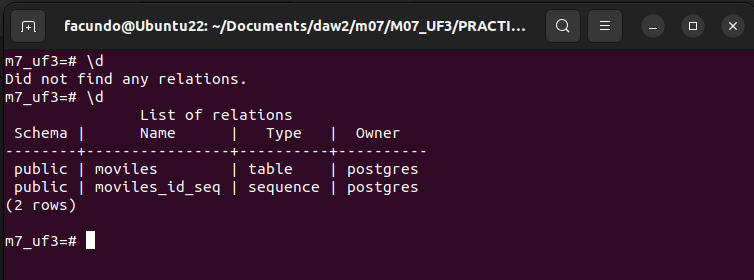
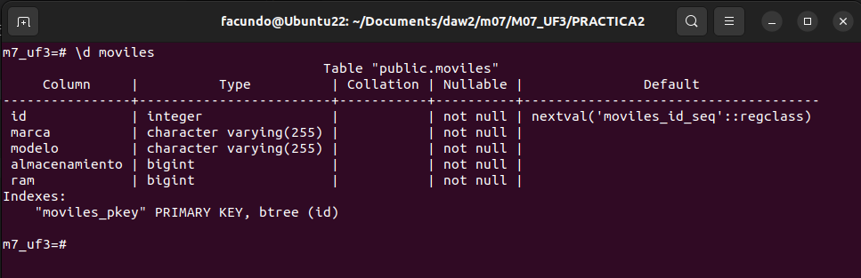
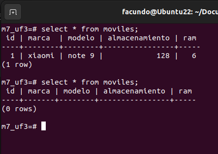
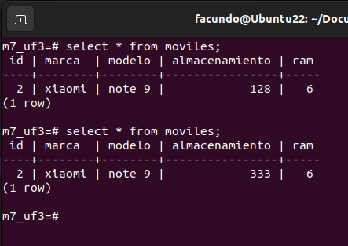

# CRUD con Python y Postgresql
## Facundo Barrios
### Aclaración: las capturas fueron realizadas en el terminal, porque no tengo PgAdmin pero he trabajado en postgres modo consola. 

Capturas de pantalla de la BBDD después de cada operación. 

A medida que creaba una funcionalidad, la probaba en Python y luego hacia un Select * para ver los cambios, por eso todas las consultas empiezan con Select * (por obvias razones las queries de CRUD de prueba no se ven, fueron datos de prueba generados en el momento)

Antes y después de crear la tabla:

Datos de la tabla:

Insertar y eliminar un registro:

Antes y después de modificar un registro:

